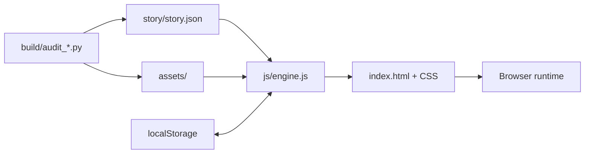

<p align="center">
  
</p>

<h1 align="center">Galgame Web Engine</h1>

<p align="center">
  <strong>A zero-build visual novel / Galgame starter for the browser.</strong><br>
  Vanilla HTML + CSS + JavaScript. JSON story graph. Branching routes. Save/load. CG gallery. Audio hooks. Codex-friendly workflow.
</p>

<p align="center">
  
  
  
  
  
</p>

<p align="center">
  <a href="README.en.md">English</a> · <a href="README.zh-CN.md">简体中文</a> ·
  <a href="docs/STORY_SCHEMA.md">Story schema</a> · <a href="docs/CODEX_WORKFLOW.md">Codex workflow</a>
</p>

---

## Why this exists

Most visual-novel engines are powerful, but sometimes you want something you can understand by opening three files in a text editor.

**Galgame Web Engine** is a dependency-light starter extracted from a real multi-route visual novel project. The runtime is intentionally plain: no npm, no bundler, no framework, no database. The game can be hosted anywhere that serves static files.

> Clone → edit JSON → replace art → run locally → publish.

The repository ships with **lightweight inline SVG placeholder art** so the starter can remain fully open-source and easy to fork. Replace it with your own art/audio as your project grows.

## Features

| Runtime | Story / routes | Player UX | Project tooling |
|---|---|---|---|
| Vanilla HTML/CSS/JS | JSON-driven node graph | Multi-slot save/load | Story graph audit |
| Static hosting | Choices + variable effects | Autosave | Reachability checks |
| Full-size sprite layer | Conditional branches | Rollback | Missing-asset checks |
| Portrait cards | Multiple heroines/routes | AUTO | Duplicate-art audit |
| Background + CG layers | Chapters + endings | Read-only SKIP | GitHub Actions audit |
| BGM/SFX hooks | Unlocks + achievements | History | `AGENTS.md` for Codex |
| Phone/cinematic nodes | Relationship variables | Gallery / music room | Release checklist |

## Quick start

```bash
git clone https://github.com/bettercallcaleb/galgame-web-engine.git
cd galgame-web-engine
./start.sh --port 10000
```

Open:

```text
http://127.0.0.1:10000
```

Windows:

```bat
start.bat 10000
```

You can also use any static server, for example:

```bash
python3 -m http.server 10000
```

## Project map

```text
index.html             UI shell
css/game.css           presentation + responsive layout
js/engine.js           visual-novel runtime
story/story.json       story graph and game metadata
assets/                asset replacement notes
docs/                   architecture, schema, assets, Codex workflow
examples/               minimal story example
build/audit_story.py    graph/reachability/asset-reference audit
build/audit_assets.py   duplicate-art audit
AGENTS.md               repository instructions for coding agents
```

## Story in one glance

A regular node is just JSON:

```json
{
  "cafe_01": {
    "bg": "cafe_day",
    "speaker": "林夏",
    "sprite": "neutral",
    "text": "你今天看起来有点心不在焉。",
    "choice": [
      {
        "text": "告诉她真相",
        "effects": {"affection": 1, "honesty": 1},
        "next": "cafe_honest"
      },
      {
        "text": "转移话题",
        "effects": {"secrecy": 1},
        "next": "cafe_deflect"
      }
    ]
  }
}
```

Supported node families include normal dialogue, `chapter`, `cinematic`, `phone`, `cg`, `branch`, and `ending` nodes. See **[Story Schema](docs/STORY_SCHEMA.md)** for the field-level contract.

## Architecture



The project deliberately keeps the story graph, runtime, and assets separate. That makes it easy to replace the demo story without rewriting the engine.

## Build your own game

1. Change title, chapters, characters, and start node in `story/story.json`.
2. Add or replace backgrounds, sprites, portraits, CGs, BGM, and SFX.
3. Register semantic asset keys near the top of `js/engine.js`.
4. Write routes in small chapters with stable node IDs.
5. Run audits after structural or asset changes.
6. Play through failure-prone branches before release.

Validation:

```bash
python3 build/audit_story.py
python3 build/audit_assets.py
```

`audit_assets.py` uses Pillow for raster-image similarity checks:

```bash
python3 -m pip install pillow
```

## Develop with Codex

This repository includes a short **[`AGENTS.md`](AGENTS.md)** plus deeper docs so Codex (or another coding agent) can work without guessing the project invariants.

A good first prompt:

```text
Read AGENTS.md and docs/*.md. Do not modify anything yet.
Summarize the runtime architecture, story schema, validation commands,
and the safest extension points for a new heroine route.
```

Then ask for a narrow, testable change:

```text
Add one optional heroine route with one chapter and one ending.
Use existing runtime features only.
Keep stable node IDs and avoid unrelated rewrites.
Register new assets with semantic keys.
Run both audits and smoke-test the changed route before finishing.
```

More examples: **[Codex Workflow](docs/CODEX_WORKFLOW.md)**.

## Extending the engine

Good first contributions:

- animated sprite transitions
- localization layer / string tables
- mobile-first dialogue UI
- controller / keyboard navigation
- accessibility improvements
- import/export tooling for story graphs
- richer condition expressions
- automated route playthrough tests

Please read **[CONTRIBUTING.md](CONTRIBUTING.md)** before sending a PR.

## Design goals

- **Readable:** no framework required to understand the runtime.
- **Forkable:** swap the story and assets without rebuilding the engine.
- **Auditable:** broken links and unreachable nodes should fail loudly.
- **Agent-friendly:** rules and architecture live in-repo, not in someone's head.
- **Static-hostable:** GitHub Pages, Cloudflare Pages, Netlify, nginx, or a local server all work.

## License

Code and repository documentation are released under the **MIT License**.

The starter's placeholder visuals are generated inline as SVG data. When you add third-party art, music, fonts, or sound effects, verify redistribution rights before publishing your fork. See [NOTICE.md](NOTICE.md).

---

<p align="center">
  <strong>Make the story yours.</strong><br>
  If you build something with it, a link back to this repository is appreciated.
</p>
