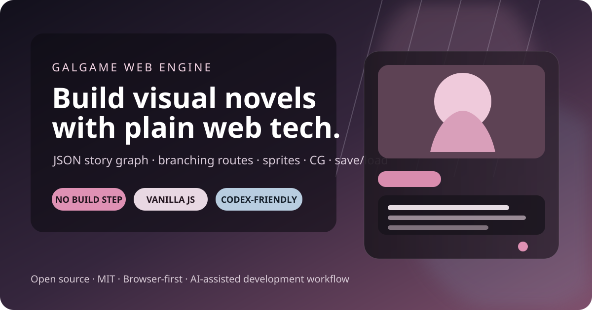
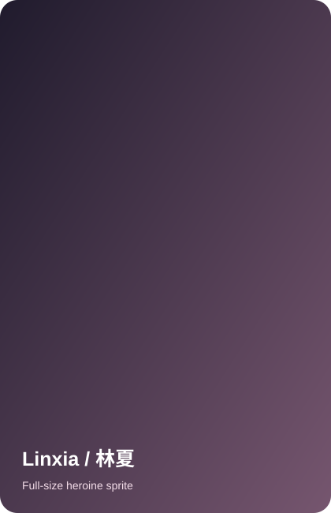
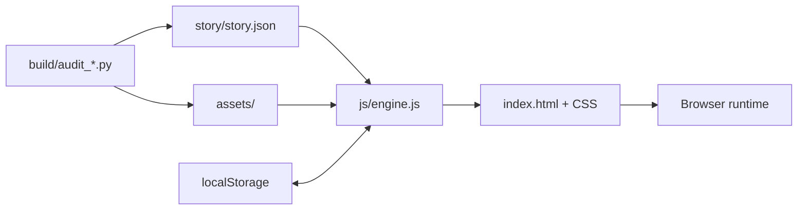

<p align="center">
  
</p>

<h1 align="center">Galgame Web Engine</h1>

<p align="center">
  <strong>Build browser-based visual novels with vanilla HTML, CSS, and JavaScript.</strong><br>
  A zero-build open-source starter for branching stories, full-size heroine sprites, CGs, audio, save/load, and Codex-friendly development.
</p>

<p align="center">
  
  
  
  
  
</p>

<p align="center">
  <a href="README.en.md">English</a> ·
  <a href="README.zh-CN.md">简体中文</a> ·
  <a href="docs/STORY_SCHEMA.md">Story Schema</a> ·
  <a href="docs/CODEX_WORKFLOW.md">Codex Workflow</a> ·
  <a href="docs/ARCHITECTURE.md">Architecture</a>
</p>

---

## ✨ Showcase

<p align="center">
  
</p>

<p align="center">
  <sub>Full-size heroine art from the reference demo that this starter was extracted from.</sub>
</p>

---

## Why this exists

Most visual-novel engines are powerful, but sometimes you want something you can understand by opening a handful of files in a text editor.

**Galgame Web Engine** is a dependency-light starter extracted from a real multi-route browser Galgame. The runtime is intentionally plain:

- no npm
- no bundler
- no framework
- no database
- no opaque build pipeline

Just edit the story JSON, swap the art/audio, and ship to any static host.

> **Clone → edit JSON → replace assets → run locally → deploy anywhere.**

## What you get

| Runtime | Story / routes | Player UX | Tooling |
|---|---|---|---|
| Vanilla HTML/CSS/JS | JSON-driven node graph | Multi-slot save/load | Story audit |
| Static hosting | Choices + variables | Autosave | Reachability checks |
| Background + CG layers | Branching routes | Rollback / History | Missing-asset checks |
| Full-size heroine sprites | Multiple heroines | AUTO / read-only SKIP | Duplicate-art audit |
| Portrait cards | Chapters + endings | Gallery / music room | Codex docs |
| BGM/SFX hooks | Unlocks + achievements | Keyboard shortcuts | GitHub Actions audit |
| Phone / cinematic nodes | Relationship states | Responsive UI | Release checklist |

## Quick start

```bash
git clone https://github.com/bettercallcaleb/galgame-web-engine.git
cd galgame-web-engine
./start.sh --port 10000
```

Open:

```text
http://127.0.0.1:10000
```

Windows:

```bat
start.bat 10000
```

Or use any static server:

```bash
python3 -m http.server 10000
```

## Project map

```text
index.html              UI shell
css/game.css            presentation + responsive layout
js/engine.js            browser runtime entry
story/story.json        story graph and game metadata
assets/                 replaceable game assets
examples/               minimal story example
build/audit_story.py    graph and reference audit
build/audit_assets.py   duplicate-image audit
AGENTS.md               project instructions for coding agents
docs/                   architecture, schema, assets, Codex workflow
```

## Story format

A scene is plain JSON:

```json
{
  "cafe_01": {
    "bg": "cafe_day",
    "speaker": "Linxia",
    "sprite": "neutral",
    "text": "You look a little distracted today.",
    "choice": [
      {
        "text": "Tell her the truth",
        "effects": {"affection": 1, "honesty": 1},
        "next": "cafe_honest"
      },
      {
        "text": "Change the subject",
        "effects": {"secrecy": 1},
        "next": "cafe_deflect"
      }
    ]
  }
}
```

Supported node families include dialogue, `chapter`, `cinematic`, `phone`, `cg`, `branch`, and `ending`. See **[Story Schema](docs/STORY_SCHEMA.md)** for the full contract.

## Architecture



The story graph, runtime, and assets are deliberately separate. You can replace the demo story and presentation without rebuilding the engine.

## Build your own Galgame

1. Change game metadata, characters, chapters, and start node in `story/story.json`.
2. Replace backgrounds, sprites, portraits, CGs, BGM, and SFX.
3. Register semantic asset keys in `js/engine.js`.
4. Write routes in small, testable chapters with stable node IDs.
5. Run audits after structural or asset changes.
6. Play through fragile branches before release.

Validation:

```bash
python3 build/audit_story.py
python3 build/audit_assets.py
```

`audit_assets.py` uses Pillow:

```bash
python3 -m pip install pillow
```

## Develop with Codex

This repository includes **[`AGENTS.md`](AGENTS.md)** plus deeper docs so Codex can work without guessing project rules.

A good first prompt:

```text
Read AGENTS.md and docs/*.md. Do not modify anything yet.
Summarize the runtime architecture, story schema, validation commands,
and the safest extension points for a new heroine route.
```

Then ask for a narrow, testable change:

```text
Add one optional heroine route with one chapter and one ending.
Use existing runtime features only.
Keep stable node IDs and avoid unrelated rewrites.
Register new assets with semantic keys.
Run both audits and smoke-test the changed route before finishing.
```

More examples: **[Codex Workflow](docs/CODEX_WORKFLOW.md)**.

## Good first contributions

- animated sprite transitions
- localization / string tables
- mobile-first dialogue UI
- controller / keyboard navigation
- accessibility improvements
- story graph import/export tooling
- richer condition expressions
- automated route playthrough tests

Please read **[CONTRIBUTING.md](CONTRIBUTING.md)** before sending a PR.

## Design goals

- **Readable** — no framework required to understand the runtime.
- **Forkable** — replace the story and assets without rebuilding the engine.
- **Auditable** — broken links and unreachable nodes should fail loudly.
- **Agent-friendly** — project rules live in-repo, not in someone's head.
- **Static-hostable** — GitHub Pages, Cloudflare Pages, Netlify, nginx, or a local server all work.

## License

Code and documentation are released under the **MIT License**.

The showcase image above is from the reference demo. When you add third-party art, music, fonts, or sound effects, verify redistribution rights before publishing your fork. See [NOTICE.md](NOTICE.md).

---

<p align="center">
  <strong>Make the story yours.</strong><br>
  If you build something with it, a link back to this repository is appreciated.
</p>
