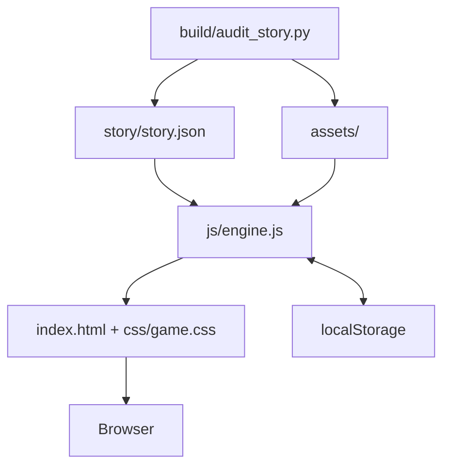

# Architecture

Galgame Web Engine is a static browser application.

## Runtime layers

- `index.html` defines the UI shell.
- `css/game.css` controls presentation, responsive layout, transitions, dialogue UI, galleries, modals, and sprite positioning.
- `js/engine.js` loads story JSON, manages runtime state, renders nodes, applies variables/effects, handles save/load, history, rollback, AUTO/SKIP, galleries, unlocks, BGM/SFX hooks, and UI actions.
- `story/story.json` is the story graph and metadata.
- `assets/` contains replaceable media.
- `localStorage` stores saves, settings, seen-node state, runtime stats, and unlocks.

## Story execution

The runtime maintains a current node ID and variable map. A node can render dialogue or dispatch to a typed handler such as chapter, cinematic, phone, CG, branch, or ending. Choices apply effects and jump to another node.

## Why no framework

The project is meant to be forkable and inspectable. A developer or coding agent can understand the core runtime without first reconstructing a bundler/framework toolchain.
